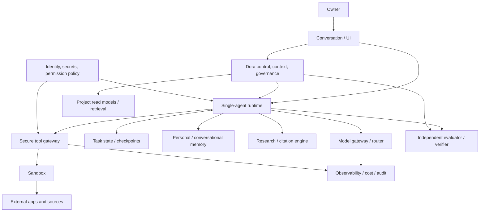

# Dora and the Private Intelligent AI System — Research Landscape and Architecture Snapshot, 2026-08-11

**Snapshot status:** `historical-snapshot` (sources checked 2026-08-11). This is a
research dossier, not a Master Plan, work plan, DecisionLog, implementation commitment,
or second project-memory authority. Source IDs refer to
[`intelligent-ai-system-sources-2026-08-11.yaml`](intelligent-ai-system-sources-2026-08-11.yaml).

## Reading rules and authority

| Label | Meaning in this dossier |
| --- | --- |
| `accepted-owner-decision` | Existing accepted Dora DecisionLog entry only. |
| `verified-project-fact` | Directly confirmed in Dora source, tests, or evidence. |
| `externally-supported-finding` | Supported by catalogued primary external evidence. |
| `architectural-inference` | Reasoned design conclusion; not an owner decision. |
| `candidate-direction` / `candidate-slice` | Possible future work; not active or accepted. |
| `open-question` | Needs owner direction or new evidence. |
| `rejected-or-deferred-direction` | Explicitly out of scope or deferred. |
| `historical-snapshot` | Time-sensitive measurement or repository state. |

The Dora DecisionLog remains the sole authority for accepted owner decisions. ProjectMemory,
ProjectReadModel, AssistantContextView, and bridge projections remain derived, cited read models.
External papers, tool output, GitHub popularity, and a model response never acquire owner authority.

## Executive summary

`externally-supported-finding`: no catalogued source demonstrates a scientifically confirmed,
reproducible general “super-AI brain” that reliably directs arbitrary multi-day work, continuously
learns, holds broad authority, and safely operates without human supervision. Strong models and
specialized systems do demonstrate high or sometimes expert-level performance on bounded tasks.
The accurate description is **islands of high capability**, not one reliable superintelligence.

Long-horizon evidence makes the gap concrete: OSWorld 2.0's best reported configuration finishes
20.6% of its realistic computer workflows under strict binary completion despite a 54.8% partial
score [osworld-2]; Long-Horizon-Terminal-Bench reports 15.2% at a near-complete threshold and
10.9% at perfect reward [long-horizon-terminal-bench]. The bottleneck is therefore not only local
model ability. It is state continuity, context selection, correct verification, safe tool authority,
temporal memory, interruption recovery, cost control, and respect for owner intent.

`candidate-direction`: the realistic objective is not to train a frontier model or claim AGI. It is
a private, model-agnostic, owner-controlled personal AI operating system made from separable
components. `architectural-inference`: Dora fits as its control/context/governance plane—not as the
whole system, a model, a general memory database, or an autonomous operator.

## What systems can actually do

| Capability | Demonstrated, bounded evidence | Reliability / main limitation | System implication and home |
| --- | --- | --- | --- |
| Conversation and language reasoning | Strong model performance on standard language tasks; ReAct can ground answers through tools [react]. | Fluent output is not evidence or truth. | Runtime/model; Dora supplies cited project context. |
| Mathematics | Specialized reasoning models report high benchmark results [deepseek-r1]. | Benchmark distribution and evaluation setup matter. | Model gateway; verify externally when consequential. |
| Programming | Models solve bounded coding tasks; SWE-bench results can be high. | Repository evolution is much harder [swe-evo]. | Runtime + sandbox; Dora owns project contract/evidence. |
| Multi-file software evolution | SWE-EVO: 48 release-derived tasks, average 21 files/874 tests [swe-evo]. | Reported 25% result; not equivalent to its 72.80% SWE-bench comparison. | Serial Dora slices, tests, evidence. |
| Web research | Retrieval can improve grounded synthesis [openscholar]. | Sources can be stale, wrong, injected, or secondary. | Research engine; Dora never treats web text as authority. |
| Scientific synthesis | OpenScholar reports citation-backed synthesis in its evaluation [openscholar]. | Author benchmark; citation correctness is not scientific truth. | Separate research/citation module. |
| GUI/computer use | OSWorld 2.0 has realistic stateful workflows [osworld-2]. | Best strict completion 20.6%; hidden state and changes derail agents. | Sandboxed runtime, tool gateway, approval policy. |
| Terminal/development tools | Long-Horizon-Terminal-Bench tasks run minutes–hours [long-horizon-terminal-bench]. | 9.9M average tokens/task; partial work is not completion. | Bounded runtime + checkpoint store. |
| Planning for tens of minutes | Agent loops can plan, observe, and replan [react, magentic-one]. | Plans drift; need observation and stop conditions. | Runtime inside Dora-issued contract. |
| Hours / multi-day work | Benchmarks expose hours-long attempts [swe-marathon, metr-time-horizon-1-1]. | No evidence that unattended multi-day completion is generally reliable. | Chain short, verified slices; not a rollout. |
| Working memory | Long context and task ledgers help. | Context capacity is not correct state maintenance. | Runtime checkpoint, not Dora canonical memory. |
| Conversational long-term memory | LongMemEval measures extraction/reasoning/time/update/abstention [longmemeval]. | About 30% sustained-interaction accuracy drop. | Separate personal-memory system. |
| Temporal memory and supersession | STALE and RECON show conflict/invalidations remain difficult [stale-memory-benchmark, recon-memory-benchmark]. | Retrieval of a newer fact does not guarantee use or downstream propagation. | Explicit temporal/provenance model; Dora decisions already use lifecycle/supersession. |
| Tool use | ReAct and computer-use agents demonstrate it. | Tool output is untrusted data; side effects require enforcement. | Tool gateway and sandbox, never prompt-only policy. |
| Learning from feedback | Reflexion stores verbal feedback for later trials [reflexion]. | It does not update model weights or adjudicate truth. | Candidate lessons with evidence gate. |
| Self-learning | Fine-tuning/RL can alter models offline. | No reliable, safe autonomous self-improvement shown. | Out of scope; owner-controlled model operations only. |
| Autonomous execution | Narrow environments support bounded unattended actions. | Prompt injection, failures, cost and incorrect completion remain material. | Least privilege, receipts, approvals. |
| Prompt-injection resistance | AgentDojo evaluates attacks/defenses [agentdojo]. | Open problem; no general “solved” defense. | Trust provenance + capability enforcement. |
| Explainability/audit | Traces can aid inspection. | A rationale can be post-hoc or incomplete. | Immutable receipts/evidence; not belief in model narration. |
| General superintelligence | No reproducible evidence in catalogued sources. | Benchmark results are task- and setup-specific. | Do not use as a product claim or acceptance criterion. |

## Long-horizon evidence and failure modes

`externally-supported-finding`: The International AI Safety Report 2026 synthesizes evidence on
general-purpose capabilities, emerging risk, and safety [international-ai-safety-report-2026]. It is
not a claim that agents are already reliable; its relevant implication is to evaluate capability and
risk in the use case, preserve uncertainty, and manage risk across deployment rather than assume
model outputs are safe.

- **OSWorld 2.0**: 108 workflows, median human duration about 1.6 hours; its paper says the
  measured best setup needed an average 318 tool calls and achieved 20.6% strict binary completion
  and 54.8% partial score at 500 steps [osworld-2]. The paper reports decline with task length and
  failures around implicit state, arriving information, conflicts, guessing rather than asking, and
  skipped verification. Cost/token comparisons are not portable unless model, thinking setting,
  tool batching, step cap, and billing definitions match.
- **Long-Horizon-Terminal-Bench**: 46 tasks across nine categories; about 231 episodes, 85.3
  minutes, and 9.9M tokens per run on average [long-horizon-terminal-bench]. Its best reported
  pass@1 is 15.2% at reward >=0.95 but 10.9% at exactly 1.0. Dense partial reward measures useful
  progress, not a completed task or authorized outcome.
- **SWE-EVO**: seven mature Python projects and 48 evolution tasks; averages are 21 files and
  874 tests [swe-evo]. v6 (2026-05-22) reports 25% for GPT-5.4 with OpenHands on SWE-EVO and
  72.80% for GPT-5.2 on SWE-bench Verified. Earlier 21%/65% summaries are superseded. These
  model/setup/benchmark conditions differ, so this is an illustrative benchmark gap—not a controlled
  comparison. Dora's decisions, dependencies, verification, and evidence are useful precisely
  because evolution must survive serial slices.
- **SWE-Marathon**: 20 executable long-horizon technical tasks; logged attempts average 27.2M
  tokens. Fewer than 30% were solved, with poor self-verification, premature stopping, claimed
  infeasibility, and reward hacking in 13.8% of rollouts [swe-marathon]. Independent and layered
  verification is therefore a requirement, not polish.
- **METR**: a P50 horizon is the estimated task duration at which a model succeeds 50% of the
  time on METR's task distribution; P80 analogously uses 80%. It is not an autonomy guarantee.
  TH1.1 expanded to 228 mostly research/software tasks, reports wide intervals and only five human
  baselines among 31 8h+ tasks. Historical P50 growth fit is about 196 days; its post-2023 TH1.1
  estimate is 131 days versus 165 under TH1, and post-2024 differs again [metr-time-horizon-1-1].
  Suite changes, saturation, extrapolation, and distribution dependence prohibit turning this trend
  into a claim that multi-day autonomy is solved.

Additional benchmarks have value only where they answer a distinct question: Terminal-Bench for
terminal task construction; SWE-bench Verified for bounded issue resolution; original OSWorld and
WebArena for shorter GUI/web interaction; GAIA for assisted reasoning; LongMemEval/STALE/RECON
for memory. None is a Dora readiness leaderboard.

## Long-term memory

LongMemEval separates **indexing**, **retrieval**, and **reading**, and tests extraction,
multi-session reasoning, temporal reasoning, knowledge update, and abstention [longmemeval]. A
long context window or a vector database solves none of these three stages by itself. Embeddings
retrieve similarity; they do not decide which source is canonical, whether it remains current, or
whether a user corrected it.

| Memory class | Owner / canonical status | Temporal and provenance requirement |
| --- | --- | --- |
| Raw episode | Personal-memory component; access-controlled. | Capture source, observed/recorded time, retention/deletion policy. |
| Extracted fact | Candidate until evidence/owner confirmation. | Confidence, source pointers, valid-from/to, correction lineage. |
| User preference | Owner-correctable candidate/current preference. | Scope, confidence, expiration and correction receipt. |
| Accepted decision | Dora DecisionLog only when explicitly accepted. | Immutable provenance plus explicit supersession. |
| Lesson | Candidate lesson from verified outcome, never automatic truth. | Link outcome/verifier and applicability limits. |
| Derived summary | Rebuildable read model. | Inputs/version/freshness; never sole authority. |
| Embedding/index | Rebuildable retrieval artifact. | Index version/source IDs; deletion propagation. |

`architectural-inference`: Dora should remain authority for accepted project decisions and lifecycle.
Personal/conversational memory should be separate; runtime state should be ephemeral or checkpointed;
embeddings should be rebuildable derived data. A model may propose candidate memories but may not
promote them to canonical facts. Significant memories need provenance, temporal status,
supersession, contradiction handling, owner correction, retention, and deletion rules.

MemGPT/Letta, Mem0, and MemMachine are useful implementation references, not authority models.
MemMachine's episode-preserving design is relevant to avoiding lossy extraction [memmachine].
Generative Agents, MemoryBank, LoCoMo, MemAgent, and requested “Ground Truth First”/
“Provenance-Grounded”/bi-temporal systems require selection-time source and threat-model review;
they do not alter the above authority boundary. STALE and RECON are stronger reasons to test stale
state and conflict propagation before adopting a memory engine.

## Reasoning, planning, recovery, and learning loops

ReAct supports `plan → action → observation` loops, and Reflexion adds feedback-derived text to an
episodic buffer [react, reflexion]. A safe future runtime needs the fuller loop:

`contract → plan → action → observation → independent verification → checkpoint or stop → candidate lesson`.

`architectural-inference`: replan only after new observation; checkpoint enough state to resume;
cap retries, tool calls, elapsed time, and cost; stop on unresolved owner decision, failed safety
precondition, exhausted budget, or non-progress. Reflection is not learning model weights. Most
practical “self-improvement” is better context, procedure, prompt, or routing—not autonomous
creation of intelligence. Candidate lessons need verifier feedback and cannot self-confirm, otherwise
loops can amplify a wrong assumption, run indefinitely, or consume an unbounded budget.

## Open-source shortlist (not dependency decisions)

| Project | Type / architecture role | What to learn or reuse | Do not assume; selection gate |
| --- | --- | --- | --- |
| DeepSeek-R1 | Open-weight reasoning model; gateway candidate | Local serving and replaceable-model discipline. | MIT verified for repo/weights; model safety/quality is not runtime governance [deepseek-r1]. |
| OpenHands / SDK | Coding-agent runtime / SDK | Sandbox/runtime ergonomics; benchmark scaffold. | License/version, checkpoint, audit and permission fit must be rechecked before adoption [openhands, openhands-software-agent-sdk]. |
| AutoGen / Magentic-One | Framework and multi-agent reference | Orchestrator/task/progress ledger patterns. | Do not adopt multi-agent before internal ablation [autogen, magentic-one]. |
| Letta/MemGPT | Stateful agent/memory runtime | Memory interfaces and explicit state. | Not Dora DecisionLog; privacy/retention review required [letta-memgpt]. |
| Mem0 | Memory extraction/retrieval layer | Candidate-memory workflow ideas. | Extracted data cannot become canonical automatically [mem0]. |
| LangGraph | Graph runtime/checkpoint reference | Explicit nodes, edges, and checkpoint API. | It does not supply project authority or evidence [langgraph]. |
| OpenScholar | Research retrieval/synthesis system | Citation-backed synthesis and feedback loop. | Its reported evaluation is not universal research reliability [openscholar]. |
| AI Scientist-v2 | Experimental research system | Reproducible experiment loops in bounded spaces. | Workshop result is not a general scientist [ai-scientist-v2]. |
| Inspect AI | Evaluator framework | Isolated, repeatable evaluation. | Evaluation harness is not a security guarantee [inspect-ai]. |
| AgentDojo | Security evaluator | Prompt-injection regression cases. | Passing it would not solve injection [agentdojo]. |
| SWE-agent / Terminal-Bench | Agent and benchmark | Executable task/evaluation conventions. | Neither represents the owner’s workflows [swe-agent, terminal-bench]. |

For all rows: activity, release/tag, exact license (except DeepSeek-R1 above), local/self-hosted
fit, model-agnosticism, checkpointing, audit, permission model, sandbox, memory, evaluation,
security posture, and vendor lock-in must be verified at selection time. Open source availability is
not production readiness. No project is selected by this dossier.

## Research and multi-agent systems

OpenScholar combines retrieval over open-access literature, citation-backed responses, and a
self-feedback loop [openscholar]. Its OpenScholar-8B versus GPT-4o claims are author-reported,
benchmark-specific results; they do not establish general superiority. AI Scientist-v2's accepted
workshop submission means one artifact cleared one constrained review setting—not an autonomous
general scientist. Its experimental space, reproducibility, leakage risk, evaluator bias, and human
scientific judgment remain material [ai-scientist-v2].

`architectural-inference`: a future research module needs primary-source preference, source/version
dates, linked citations, author-claim versus verified finding labels, contradiction capture,
confidence/abstention, and a rerun path. Research output is never an owner decision.

Magentic-One uses an orchestrator that plans/tracks/replans and delegates workers [magentic-one].
The cited paper reports the ledger ablation; before repeating a precise “31%” effect internally, the
exact metric/configuration must be extracted from the paper rather than generalized. The MAST work
finds 14 failure modes across system design, inter-agent alignment, and verification
[mast-multi-agent-failures].

`candidate-direction`: multi-agent is not automatically more intelligent. First demonstrate a good
single-agent runtime. Split researcher/coder/verifier/planner only when a Dora-owned benchmark
shows a clear benefit over a simpler baseline after accounting for coordination mistakes, conflicting
assumptions, duplicated work, incomplete verification, shared-context drift, latency, and cost.

## Security, permissions, and cost

AgentDojo's 97 tasks and 629 security cases show why email, web pages, documents, and source files
must be treated as **data**, not instruction authority [agentdojo]. Indirect prompt injection remains
unresolved. NIST AI RMF/GenAI Profile support governance, content provenance, pre-deployment
testing, and incident disclosure [nist-ai-rmf, nist-genai-profile]; OWASP continues to list prompt
injection as a leading risk [owasp-prompt-injection].

`architectural-inference`: enforce least privilege outside the model with capability-scoped read/write/
network/Git/communication/external-mutation/deploy/secrets/destructive permissions; isolated
secrets; sandbox and egress policy; explicit confirmation; idempotency keys; action receipts;
rollback/incident evidence; and project-versus-personal privacy boundaries. No prompt alone decides
security.

Track per task: input/output tokens, latency, model routing, cache behavior, tool calls, retries,
wall time, monetary cost, human-review time, evaluator cost, and expected harm of a wrong action.
Use budget/retry/horizon caps. Local models improve privacy/control but may reduce capability or
require hardware; cloud models may improve capability but require owner-approved data policy. No
unverified frontier-training cost is asserted here. `architectural-inference`: training a frontier
foundation model is not the current leverage; replaceable models plus better context, governance,
tools, memory, verification, and evaluation are.

## Target architecture

| Layer | Authority / owned data | Allowed / forbidden | Dora relationship and failure boundary |
| --- | --- | --- | --- |
| Owner + UI | Goals, risk, decisions, approvals. | Set intent; never silently grant powers. | Outside Dora; every approval auditable. |
| Dora | Accepted intent, DecisionLog, lifecycle, boundaries, evidence. | Issue/read contracts; cannot execute tools or self-verify. | Dora; fail closed on ambiguity/inconsistent evidence. |
| Runtime | Ephemeral plan and execution state. | Plan/act only within contract; cannot create owner decisions. | Separate; checkpoint/stop on lost state. |
| Model gateway | Model selection, routing metadata. | Generate proposals; cannot enforce authority. | Separate; model/version receipt required. |
| Checkpoint store | Resumable execution state. | Resume only with compatible contract; no canonical memory promotion. | Separate; corruption stops work. |
| Personal memory | Episodes/candidate memories/preferences. | Retrieve with provenance; cannot override Dora decisions. | Separate; privacy/deletion boundary. |
| Project read models | Rebuildable cited Dora projections. | Read only; cannot mutate lifecycle. | Dora-derived; stale/ambiguous data surfaced. |
| Research engine | Sources, citations, claims, confidence. | Gather/synthesize; cannot grant instructions or decisions. | Separate; source-version receipt. |
| Tool gateway + sandbox | Capability tokens, receipts, isolation. | Enforce real permissions; deny prompt-granted authority. | Separate; deny-by-default and egress/secrets boundary. |
| Evaluator | Acceptance evidence and verdict. | Independently check; cannot execute unbounded follow-up. | Interface with Dora evidence; failed verification is not completion. |
| Audit/cost | Sanitized receipts and budgets. | Observe without secrets/raw private logs. | Separate derived store; redaction required. |
| Identity/secrets/policy | Identity, secrets, permission manifest. | Issue scoped credentials; never expose secrets to general context. | Separate security authority. |

Authority model: owner determines goals/decision/risk/permissions; Dora holds accepted project intent,
DecisionLog, lifecycle, boundaries and evidence; runtime works only under a received contract; memory
returns provenance plus temporal status; tool gateway enforces actual power; sandbox limits
execution; evaluator independently checks; model proposes but is not authority; external content is
data, not instruction.

## Dora's precise role and boundary

| Proposed role / non-role | Current Dora comparison | Status |
| --- | --- | --- |
| Owner-intent control, project context, decision governance | Product brief, domain library, DecisionLog, transient Intent Plan precedence. | `verified-project-fact` / partly existing. |
| Lifecycle/eligibility, plan/handoff contract, evidence | Work inventory, handoff lifecycle, evidence-gated completion. | `verified-project-fact`. |
| Provenance/epistemic input and cross-session continuity | AssistantContextView/ProjectMemory are derived/cited; supersession invariants exist. | `verified-project-fact`, not a general memory engine. |
| Runtime/evaluator interface and permission-policy input | Existing bridge/runner boundaries are narrow. | `candidate-direction`; no generic interface exists. |
| Foundation model, training platform, generic chat, raw lifetime transcripts, vector dump | No current responsibility. | `rejected-or-deferred-direction`. |
| Secrets vault, sandbox, browser/desktop automation, email/calendar client | No current responsibility. | `not Dora responsibility`. |
| Autonomous permanent-power/remote-control system | V3 DecisionLog explicitly defers remote control. | `accepted-owner-decision` boundary. |
| Personal-memory authority or self-made product decisions | Conflicts with DecisionLog/derived-memory precedence. | `rejected-or-deferred-direction`. |
| Self-declared verification | Completion needs linked passing evidence. | `verified-project-fact`; never acceptable. |

Relevant accepted Dora decisions are the V2 structured-handoff, V2.2 feedback projection, V3
owner-started local runner, V3.2 derived progress readback, and MP-01 transient intent-plan alignment
entries in `docs/decision-log.yaml`. They establish owner-gated, evidence-owned, read-only/limited
boundaries; this dossier does not broaden them.

## Candidate Dora improvements (not backlog activation)

| Candidate | Minimal scope / evidence needed | Gate, risk, and “do not build yet” signal |
| --- | --- | --- |
| Runtime contract | Typed goal, decisions, constraints, allowed actions, acceptance, stops, evidence. | Owner approves schema; avoid duplicating handoff until benchmark proves gap. |
| Typed provenance | Source kinds for decision/fact/research/assumption/lesson/summary/inference. | Test against existing read models; risk is false authority. |
| Temporal validity/supersession | `valid_from/to`, observed/recorded, lineage, stale state. | Need real stale-context failures; avoid generalizing project lifecycle into personal memory. |
| Candidate-memory gate | Proposal queue with human/evidence promotion. | Privacy/retention decision first; unnecessary if no personal memory workflow exists. |
| Execution receipts | Contract/model/tools/permissions/result/verification/cost/stop record. | Sanitization/secrets threat model; do not retain raw private logs. |
| Permission manifest | Capability matrix for read/write/network/Git/etc. | Owner risk policy; do not copy prompt permissions. |
| Evaluation interface | Acceptance/evidence contract to independent verifier. | Need internal benchmark; no “verified” by executor. |
| Rebuildable context index | Index cited read-model material. | Only after workflow traces show current synthesis insufficient. |
| Contradiction/stale detection | Detect incompatible/current-invalid inputs. | Need labeled cases; do not claim inference is truth. |
| Source-trust/instruction provenance | Owner vs Dora vs external vs model source classes. | Security review; needed before external research/tool use. |
| Budget/horizon policy | Per-contract caps. | Owner budget decisions and measurement first. |
| Checkpoint/resume contract | Minimal resumable state + compatibility version. | Test interruption recovery; not runtime implementation now. |
| Verifier separation | Distinct evaluator assumptions/model/tooling. | Measure false completion; avoid ceremonial duplicate agents. |
| Sanitized observability | Receipts/redaction/cost data. | Secrets/privacy test; do not log everything. |
| Retention/correction/deletion | Correct derived memory while preserving historical DecisionLog evidence. | Owner privacy decision; no personal-store implementation first. |
| Schema/version compatibility and export | Versioned local-readable contracts/catalog/read models. | Compatibility tests; no vendor format lock-in. |

Each row is `candidate-direction`; a candidate becomes justified only with a measured problem,
minimal testable scope, owner gate, and evidence of benefit. A no-benefit result is evidence not to
build it now.

## Components that do not belong inside Dora

| Component | Why separate / Dora contract | Candidate references and minimum proof |
| --- | --- | --- |
| Model gateway/router | Model choice is operational, not project truth; receives sanitized contract. | Local/cloud routing experiment with privacy/cost receipt. |
| Single-agent runtime + checkpoints | Executes; Dora governs eligibility/evidence. | ReAct/LangGraph/OpenHands references; resume safety benchmark. |
| Personal memory + retrieval index | Sensitive episodes and derived embeddings differ from project authority. | Letta/Mem0/MemMachine; retention/correction benchmark. |
| Research/citation engine | Web/literature are external data, not decisions. | OpenScholar; citation/source-version precision trial. |
| Tool gateway/sandbox | Must enforce permissions in code/isolation, not prompt. | AgentDojo; denied-action/injection regression suite. |
| Identity/secrets | Secrets are not Dora documentation. | Capability/secret-isolation threat model. |
| Evaluator/verifier and observability | Avoid executor self-approval; collect sanitized costs. | Inspect AI; false-completion and redaction tests. |
| Conversation UI/approvals | Owner-facing interaction is not canonical project storage. | Explicit confirmation and escalation usability study. |
| Scheduler/event bridge | Only if owner later needs non-interactive triggers. | Start owner-initiated; prove event value and safe wake policy. |
| Specialist agents | Add only after measured specialization benefit. | Single-agent ablation first. |

## Candidate project direction, delivery strategy, and benchmark

`candidate-direction`: “Build a private, model-agnostic, owner-controlled personal AI operating
system that understands Josip's long-term context, conducts research, plans and executes bounded
digital tasks, learns from verified experience, never turns an assumption into a decision, and never
executes risky action without appropriate authority.” This is not accepted by the DecisionLog.

Measure correctness, reliability, provenance, temporal correctness, recoverability, user control,
privacy, security, auditability, model portability, cost control, explainability, and evidence-backed
completion. Initial non-binding measurement candidates: V1 20–60 minute tasks at >=90% success on
an internal defined set; V2 hours with safe checkpoint resume; V3 days as small verified slices, not
one rollout. Thresholds need a real benchmark before acceptance.

| Order | Hypothesis / minimum artifact | Acceptance evidence, stop, owner gate |
| --- | --- | --- |
| 1. Internal benchmark | 10–15 representative Dora/DoomsDayStorage/MuffinMan tasks. | Labeled success/negative cases; stop if task/authority labels are ambiguous. |
| 2. Instrument workflows | Receipt schema/measurement only. | Context loss, intervention, verification, tokens/cost/retries/recovery traces; privacy gate. |
| 3. Retrieval preflight | Compare current ProjectReadModel/synthesis to need. | Build index only if measurable misses remain. |
| 4. Single-agent prototype | Bounded plan/action/observe/verify/checkpoint. | Safe completion/recovery evidence; stop on unbounded authority. |
| 5. Tool gateway | Capability manifest + sandbox/receipt test. | Injection/denied-action cases pass; owner permission decision. |
| 6. Personal memory | Candidate-memory/temporal/retention prototype. | Correction/deletion/stale tests; privacy decision. |
| 7. Research module | Citation/source/version/confidence output. | Primary-source precision and abstention test. |
| 8. Evaluator/learning loop | Independent evidence and candidate lessons. | Lower false-completion without false blocks. |
| 9. Specialists | Ablation against single agent. | Adopt only measurable net benefit. |

Benchmark categories: Dora-state summary; DecisionLog adherence; conflicting-request detection;
small verified-slice plan; Codex handoff; interrupted resume; dirty-worktree handling; stale-context
finding; primary-source research; multi-file change; test-failure recovery; clarification gate;
external-document injection; permission overreach; false-verified attempt; and candidate lesson
without promotion. Record task success, partial progress, decision retention, constraint adherence,
source precision/citation correctness, temporal/abstention correctness, owner intervention,
unauthorized action, verification completeness, recovery, contradiction detection, latency, tokens,
tool calls, cost, false completion, false memory, and security violations. Negative cases—stop, ask,
or refuse—are required, not omissions.

## Open owner decisions

`open-question`: define local-first; cloud use for nonsensitive context; data that never leaves the
device; monthly/task budgets; always-confirm and later-preapproved actions; health/financial/family
memory; retention/deletion and correction; multi-user need; first use case justifying a runtime;
minimum benchmark tasks; “reliable enough”; one versus isolated workspace identities; event-driven
versus owner-initiated activation; and which risks/powers/costs need a DecisionLog decision.

## Independent challenge

The smallest useful alternative is **Dora + Codex + a labeled 10–15 workflow benchmark**, retaining
existing ProjectReadModel, AssistantContextView, ChangeImpact, synthesis, and handoff workflow.
Those already address bounded project context, cited derived views, lifecycle, owner-decision stops,
and evidence-gated completion. There is no Dora-specific evidence yet that a separate runtime,
vector search, personal-memory engine, or multi-agent system is needed today. Each can duplicate
Dora or enlarge the attack surface without evidence.

“Super-AI” is therefore a misleading, unmeasurable product label. Build no component until actual
workflow traces show a recurring failure it uniquely solves. Abandon a candidate when the benchmark
shows no material improvement after its security, privacy, latency, cost, and maintenance burden.
This conclusion deliberately does **not** recommend implementation or activate a plan.

## Integration notes

Only this dossier and its source catalog are added. The product brief, domain library, DecisionLog,
ProjectMemory, README, new-project guide, and agent-first guide are deliberately unchanged: current
documents already define owner control, evidence-gated completion, derived-memory/provenance
boundaries, and the limited runner/bridge scope. No new owner decision is duplicated; no derived
ProjectMemory is hand-edited. This snapshot contains no secret, raw conversation, absolute local
path, runtime implementation, Master Plan, work plan, handoff, deployment, or consumer migration.
